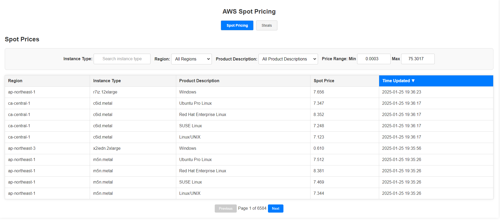
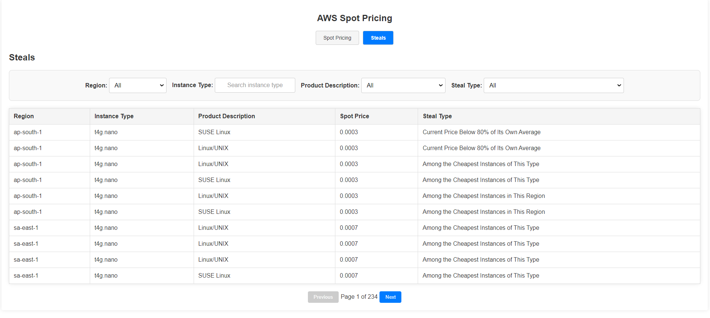

# AWS Spot Pricing App

The **AWS Spot Pricing App** is a comprehensive tool designed to fetch AWS Spot Instance pricing data, store it in a MySQL database, and provide an intuitive interface for accessing and analyzing this data. The application performs the following key functions:

1. **Data Collection**: Utilizes a PHP script in conjunction with the AWS SDK to retrieve Spot pricing data from all AWS regions and instance types.

2. **Database Management**: Automatically creates and manages three MySQL tables:
    - `spot_prices`: Contains all fetched Spot pricing data.
    - `latest_spot_prices`: Stores the current prices by recording the latest available date for each combination of instance type, region, and OS type.
    - `steal_spot_pricing`: Identifies and stores "steals"—Spot offerings that are significantly lower compared to comparable options.


3. **API and Frontend Access**: Provides a PHP backend that exposes RESTful APIs to access the database, and a Vue.js frontend that offers filtering, searching, and sorting functionalities for users to easily navigate through the Spot pricing data.


4. **Frontend Screens**:
    1. **Spot Pricing**: Displays the latest spot pricing data from the `latest_spot_prices` table, allowing users to view current prices based on instance type, region, and OS type.
    
    2. **Steals**: Presents the "steals" from the `steal_spot_pricing` table, highlighting Spot prices that are significantly lower compared to comparable options.


## Quick Start Guide

Follow these steps to quickly set up and run the AWS Spot Pricing App:

1. **Leave the Default Configuration**
   
   - Ensure that the default settings in the `backend/src/config.php` file are intact. If you need to make any changes later, you can update the configuration as required.

2. **Ensure MySQL is Running**
   
   - Make sure you have a running MySQL instance accessible at `localhost:3306`.
   - **Using Docker for Easy MySQL Instance Start**:
     
     You can quickly start a MySQL instance using Docker with the following command:
     
     ```bash
     docker run --name mysql_container \
       -e MYSQL_ROOT_PASSWORD=mysqlpw \
       -e MYSQL_DATABASE=aws_spot \
       -e MYSQL_USER=root \
       -e MYSQL_PASSWORD=mysqlpw \
       -p 3306:3306 \
       -v mysql_data:/var/lib/mysql \
       -d mysql:latest --character-set-server=utf8mb4 --collation-server=utf8mb4_unicode_ci
     ```

3. **Configure AWS Credentials**
   
   - Navigate to the `backend/src/` directory and create a `.env` file:
   
   - Open the `.env` file in your preferred text editor and add the following lines. Replace `"your path to aws credentials"` with the actual path to your AWS credentials file:
     
     ```env
     AWS_CREDENTIALS_PATH="your path to aws credentials"
     AWS_PROFILE='aws-spot-pricing'
     AWS_DEFAULT_REGION=us-east-1
     ```
   
   - Ensure your AWS credentials file (typically located at `~/.aws/credentials`) includes a profile matching the one specified in `.env` (`aws-spot-pricing`). Here's how your credentials file should look:
     
     ```ini
     [aws-spot-pricing]
     aws_access_key_id = YOUR_AWS_ACCESS_KEY_ID
     aws_secret_access_key = YOUR_AWS_SECRET_ACCESS_KEY
     ```

4. **Install Backend Dependencies and Run the PHP Backend**
   
   - Navigate back to the `backend` directory:
   
   - Install PHP dependencies using Composer:
     
     ```bash
     composer install
     ```
   
   - Start the PHP backend server:
     
     ```bash
     php -S localhost:8080 -t src/public
     ```
   
   - The backend API will now be running at `http://localhost:8080`.

5. **Run the Fetch Spot Data Script**
   
   - Navigate to the `backend/src` directory:
   
   - Execute the `fetch-spot-data.php` script to fetch and populate the Spot pricing data. The default data range is the last 5 days. **Note:** This process may take some time depending on the volume of data.
     
     ```bash
     php fetch-spot-data.php
     ```


6. **Install Frontend Dependencies and Start the Vue.js Frontend**
   
   - Open a new terminal window or tab.
   
   - Navigate to the `frontend` directory:
   
   - Install Node.js dependencies using npm:
     
     ```bash
     npm install
     ```
   
   - Start the Vue.js development server on port 3000:
     
     ```bash
     npm run serve -- --port 3000
     ```
   
   - The frontend application will be accessible at `http://localhost:3000`.

---

**You're all set!** Open your browser and navigate to `http://localhost:3000` to start using the AWS Spot Pricing App.


## Add AWS Credentials to .env

Open the `.env` file in your preferred text editor and add the following lines. Replace `"your path to aws credentials"` with the actual path to your AWS credentials file:

```env
AWS_CREDENTIALS_PATH="your path to aws credentials"
AWS_PROFILE='aws-spot-pricing'
AWS_DEFAULT_REGION=us-east-1
```
## Fetching Data Process

The `fetch-spot-data` script performs the following functions:

1. **spot_prices**: Fetches current AWS Spot pricing data and stores it in the `spot_prices` table.
2. **latest_spot_prices**: Calculates and stores the latest Spot price for each instance type and region combination in the `latest_spot_prices` table.
3. **steal_spot_pricing**: Identifies and stores "steals" by finding the five lowest Spot prices per region and per instance type in the `steal_spot_pricing` table.

The `fetch-spot-data` script can be configured in the `backend/src/config.php` file.

## PHP Backend

The PHP backend serves as the API layer, providing RESTful endpoints for data retrieval and management.

### Requirements

- **PHP**: Version 7.4 or higher
- **Composer**: Dependency manager for PHP

### Installation

1. **Navigate to the Backend Directory**:

2. **Install Dependencies with Composer**:
    ```bash
    composer install
    ```

3. **Run the PHP Backend**:
    ```bash
    php -S localhost:8080 -t src/public
    ```

    This command starts the PHP development server, serving the backend API at `http://localhost:8080`.

---


## Vue.js Frontend

The Vue.js frontend provides a user-friendly interface to view and interact with the AWS Spot pricing data.

### Requirements

- **Node.js**: Version 12 or higher
- **npm**: Node package manager

### Installation

1. **Navigate to the Frontend Directory**:

2. **Install Dependencies**:
    ```bash
    npm install
    ```

### Running the Frontend

Start the development server on port 3000:
```bash
npm run serve -- --port 3000
```

## MySQL Database

The application uses a MySQL database to store and manage AWS Spot pricing data.

- **Requirements**:
  - Ensure you have access to a running MySQL instance on `localhost:3306`.

- **Setup**:

  - **Using Docker for Easy MySQL Instance Start**:

    You can quickly start a MySQL instance using Docker with the following command:

    ```bash
    docker run --name mysql_container \
      -e MYSQL_ROOT_PASSWORD=mysqlpw \
      -e MYSQL_DATABASE=aws_spot \
      -e MYSQL_USER=root \
      -e MYSQL_PASSWORD=mysqlpw \
      -p 3306:3306 \
      -v mysql_data:/var/lib/mysql \
      -d mysql:latest --character-set-server=utf8mb4 --collation-server=utf8mb4_unicode_ci
    ```

  - **Configure Database Connection**:

    Edit the `backend/src/config.php` file with your MySQL database credentials to ensure the backend can connect to the database.

  - **Automatic Table Creation**:

    The `fetch-spot-data` script will automatically create the necessary tables (`spot_prices`, `latest_spot_prices`, `steal_spot_pricing`) if they do not exist.

- **Security Notice**:
  - The `config.php` file is uploaded to Git. **Do not** include any sensitive information such as database passwords. Use environment variables or a secure method to manage secrets securely.





